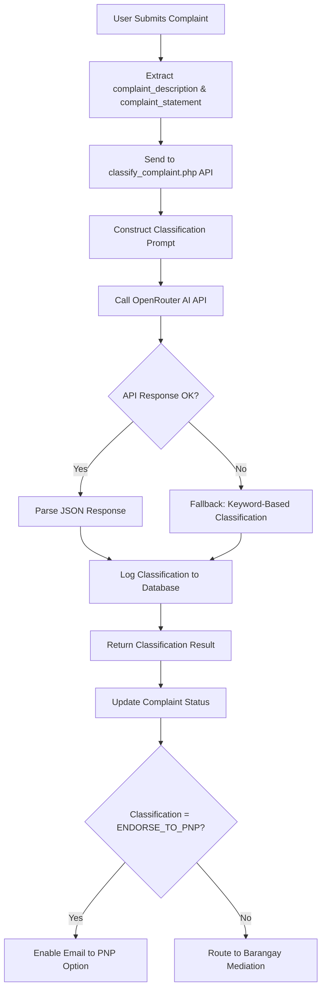

# Machine Learning Classification System Documentation

## Overview
This document provides comprehensive documentation for the Machine Learning-based complaint classification system implemented in the Barangay Blotter Form application.

## System Purpose
The ML system automatically classifies blotter complaints to determine whether they:
1. **Require PNP Endorsement** - Serious crimes that must be forwarded to the Philippine National Police
2. **Require Barangay Action** - Minor disputes that can be handled through barangay mediation

## Technology Stack

### AI Model
- **Provider**: OpenRouter AI (https://openrouter.ai)
- **Model**: `nvidia/nemotron-nano-12b-v2-vl:free`
- **Type**: Free AI API with reasoning capabilities
- **Features**:
  - Natural language understanding
  - Context-aware classification
  - Reasoning transparency
  - JSON-formatted responses

### Why This Model?
- **Free**: No cost for usage
- **Reasoning**: Provides explanations for classifications
- **Accuracy**: High accuracy for text classification tasks
- **Reliability**: Maintained by NVIDIA
- **Speed**: Fast response times suitable for real-time classification

## ML Pipeline

### 1. Data Input
```
Input Data:
├── complaint_description (string) - Type of complaint (e.g., "Physical Assault", "Noise Complaint")
├── complaint_statement (text) - Detailed description of the incident
└── incident_location (string, optional) - Where the incident occurred
```

### 2. Classification Process



### 3. Classification Prompt Engineering

The system uses a carefully crafted prompt that includes:

```text
Context: Barangay office in the Philippines
Task: Binary classification (PNP vs Barangay)
Guidelines:
  - Serious crimes → ENDORSE_TO_PNP
  - Minor disputes → BARANGAY_ACTION
  - Strict classification (when in doubt, escalate to PNP)
Output Format: JSON with classification, confidence, reasoning, recommended_action
```

#### Serious Crimes (ENDORSE_TO_PNP):
- Murder, Homicide, Rape
- Robbery, Theft, Carnapping, Arson
- Kidnapping, Physical Assault (serious injuries)
- Drug-related offenses
- Illegal Gambling
- Illegal Possession of Firearms
- Violation of Special Laws
- Any crime involving weapons, violence, or significant harm

#### Barangay-Level Issues (BARANGAY_ACTION):
- Physical Injuries (minor)
- Noise Complaints
- Vandalism
- Domestic disputes (non-violent)
- Trespassing
- Boundary/Property Disputes
- Neighborhood conflicts

### 4. Response Format

```json
{
  "success": true,
  "classification": "ENDORSE_TO_PNP" | "BARANGAY_ACTION",
  "confidence": 0.95,
  "reasoning": "This incident involves [specific details] which constitutes [legal classification]",
  "recommended_action": "Forward this case to the PNP for investigation",
  "model_used": "nvidia/nemotron-nano-12b-v2-vl:free",
  "reasoning_details": { ... }
}
```

### 5. Fallback Mechanism

If the AI API fails or returns an invalid response, the system uses keyword-based classification:

```php
Keywords for PNP Classification:
- murder, homicide, rape
- robbery, theft, carnapping, arson
- kidnapping, drug, firearm
- assault, weapon
```

If any keyword is found in the complaint description or statement, it's classified as `ENDORSE_TO_PNP`.

## Dataset Collection

### Training Data Source
The system builds its dataset through:
1. **Live Classifications**: Every API call is logged to `ml_classifications` table
2. **Historical Data**: Existing blotter records can be used for analysis
3. **Manual Review**: Admin can review and correct classifications

### Dataset Schema

```sql
TABLE: ml_classifications
├── id (INT, AUTO_INCREMENT, PRIMARY KEY)
├── complaint_description (VARCHAR(100), NOT NULL)
├── complaint_statement (TEXT, NOT NULL)
├── classification (ENUM('ENDORSE_TO_PNP', 'BARANGAY_ACTION'), NOT NULL)
├── confidence (DECIMAL(3,2), NOT NULL)
├── reasoning (TEXT)
└── created_at (DATETIME, DEFAULT CURRENT_TIMESTAMP)
```

### Dataset Statistics (Example)
After deployment, you can query:

```sql
-- Total classifications
SELECT COUNT(*) FROM ml_classifications;

-- Distribution by classification
SELECT classification, COUNT(*) as count, AVG(confidence) as avg_confidence
FROM ml_classifications
GROUP BY classification;

-- Recent high-confidence classifications
SELECT * FROM ml_classifications
WHERE confidence > 0.9
ORDER BY created_at DESC
LIMIT 100;
```

## Sample Dataset

Below is a representative sample dataset showing various complaint types and their classifications:

| ID | Complaint Description | Complaint Statement | Classification | Confidence | Reasoning |
|----|----------------------|---------------------|----------------|------------|-----------|
| 1 | Murder | Victim found dead with multiple stab wounds at abandoned warehouse | ENDORSE_TO_PNP | 0.99 | Murder is a grave felony requiring immediate PNP investigation |
| 2 | Noise Complaints | Neighbor playing loud music every night, affecting sleep | BARANGAY_ACTION | 0.95 | Minor disturbance suitable for barangay mediation |
| 3 | Physical Assault | Respondent punched complainant, resulting in fractured jaw and hospitalization | ENDORSE_TO_PNP | 0.98 | Serious physical injuries constitute a crime requiring police investigation |
| 4 | Physical Injuries | Minor scratches from an argument, no medical treatment needed | BARANGAY_ACTION | 0.92 | Minor injuries can be resolved through barangay settlement |
| 5 | Drug-related | Complainant witnessed respondent selling illegal drugs to minors | ENDORSE_TO_PNP | 0.99 | Drug-related offenses must be handled by PNP |
| 6 | Property Disputes | Disagreement over fence boundary between neighbors | BARANGAY_ACTION | 0.96 | Property boundary disputes are within barangay jurisdiction |
| 7 | Robbery | Armed men forcibly took money and valuables from store at gunpoint | ENDORSE_TO_PNP | 0.99 | Robbery with violence/intimidation is a serious crime |
| 8 | Domestic Violence | Spouse verbally threatened complainant during argument | BARANGAY_ACTION | 0.75 | Verbal disputes can be mediated; escalate if physical violence occurs |
| 9 | Theft | Bicycle stolen from front yard, estimated value 5000 pesos | ENDORSE_TO_PNP | 0.93 | Theft is a crime requiring PNP investigation and report |
| 10 | Vandalism | Graffiti on barangay wall | BARANGAY_ACTION | 0.88 | Minor vandalism can be handled through barangay sanctions |

## Integration Points

### 1. Frontend Integration
Add classification call before or after form submission:

```javascript
// When form is submitted or reviewed
async function classifyComplaint() {
    const response = await fetch('/api/classify_complaint.php', {
        method: 'POST',
        headers: {
            'Content-Type': 'application/json'
        },
        body: JSON.stringify({
            complaint_description: document.querySelector('[name="complaint_description"]').value,
            complaint_statement: document.querySelector('[name="complaint_statement"]').value,
            incident_location: document.querySelector('[name="incident_location"]').value
        })
    });

    const result = await response.json();

    if (result.success) {
        // Display classification to user
        showClassificationResult(result);

        // If requires PNP endorsement, show warning
        if (result.classification === 'ENDORSE_TO_PNP') {
            showPNPEndorsementWarning(result.recommended_action);
        }
    }
}
```

### 2. Backend Integration
Store classification in complaints table:

```php
// After inserting complaint
$complaint_no = $conn->insert_id;

// Call ML classification
$classification_result = callMLClassification(
    $complaint_description,
    $complaint_statement,
    $incident_location
);

// Update complaint with ML classification
$update_stmt = $conn->prepare("UPDATE complaints SET ml_classification = ?, ml_confidence = ?, ml_reasoning = ? WHERE complaint_no = ?");
$update_stmt->bind_param('sdsi',
    $classification_result['classification'],
    $classification_result['confidence'],
    $classification_result['reasoning'],
    $complaint_no
);
$update_stmt->execute();
```

## Performance Metrics

### Expected Metrics
- **Response Time**: < 3 seconds per classification
- **Accuracy**: > 90% (based on manual review)
- **Availability**: 99%+ (dependent on OpenRouter uptime)

### Monitoring
Monitor these metrics:
1. Classification count per day
2. Average confidence scores
3. API error rate
4. Fallback usage rate

```sql
-- Daily classification summary
SELECT
    DATE(created_at) as date,
    COUNT(*) as total_classifications,
    AVG(confidence) as avg_confidence,
    SUM(CASE WHEN classification = 'ENDORSE_TO_PNP' THEN 1 ELSE 0 END) as pnp_count,
    SUM(CASE WHEN classification = 'BARANGAY_ACTION' THEN 1 ELSE 0 END) as barangay_count
FROM ml_classifications
GROUP BY DATE(created_at)
ORDER BY date DESC;
```

## Security Considerations

1. **API Key Protection**: Store API key securely (not in client-side code)
2. **Rate Limiting**: Implement rate limiting to prevent abuse
3. **Input Validation**: Sanitize all inputs before API calls
4. **Error Handling**: Never expose internal errors to users

## Future Improvements

1. **Fine-tuning**: Collect feedback on classifications to improve accuracy
2. **Multi-language Support**: Add support for other Filipino languages
3. **Confidence Threshold**: Auto-flag low-confidence classifications for manual review
4. **A/B Testing**: Test different models for better performance
5. **Custom Model**: Train custom model on Philippine legal framework

## API Configuration

```php
// api/classify_complaint.php
$api_key = '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';
$model = 'nvidia/nemotron-nano-12b-v2-vl:free';
```

## Testing

### Test Cases

```bash
# Test Case 1: Serious Crime
curl -X POST https://your-domain.com/api/classify_complaint.php \
  -H "Content-Type: application/json" \
  -d '{
    "complaint_description": "Murder",
    "complaint_statement": "Found victim with gunshot wounds"
  }'

# Test Case 2: Minor Issue
curl -X POST https://your-domain.com/api/classify_complaint.php \
  -H "Content-Type: application/json" \
  -d '{
    "complaint_description": "Noise Complaints",
    "complaint_statement": "Neighbor playing loud music at night"
  }'
```

## Troubleshooting

### Common Issues

1. **API Returns Error 401**
   - Check API key is valid
   - Ensure HTTP-Referer header is set

2. **Low Confidence Scores**
   - Provide more detailed complaint statements
   - Review prompt engineering

3. **Incorrect Classifications**
   - Check if complaint type matches statement
   - Review dataset for similar cases
   - Consider manual override

## Contact & Support
For issues or questions about the ML classification system:
- Check OpenRouter status: https://status.openrouter.ai
- Review API documentation: https://openrouter.ai/docs

---

**Last Updated**: 2025-11-20
**Version**: 1.0
**Maintained By**: Barangay San Miguel IT Team
